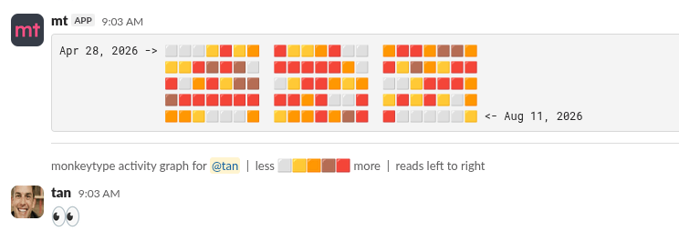

# mt

## what is it?

mt is a slack bot for monkeytype. currently it allows five commands in total:

- `/setapekey` sets/updates the api key
- `/deleteapekey` deletes the api key associated with your user
- `/lastrun` gets info about your last run and displays it in a beautiful slack message
- `/activity` shows a github-like activity graph of your monkeytype activity
- `/leaderboard` shows the leaderboard for the specified mode (tho i just learned that the method im using for that rn is horrible so that will be rewritten)

---

## how to use?

just go on slack and use `/setapekey` to set your api key. should be straightforward from thereon.

---

## how to build?

there isn't much building rn. just copy the repo, do a `bun install` and run it with `bun src/index.ts`. keep in mind tho that you'll have to create a slack app for it and set the respective slash commands and set the url for each of those commands. for the url im currently using ngrok.
